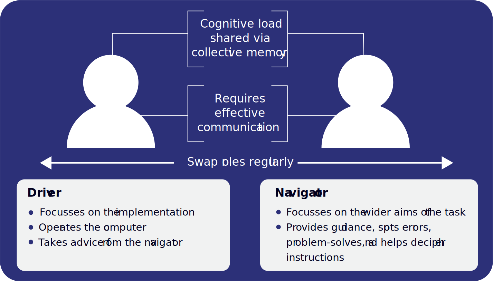

Pair programming is a pedagogical approach that you can use in your classroom which involves learners working together on a problem to develop programs. This Quick Read aims to highlight the benefits of the approach, as well as factors to consider when applying pair programming in the classroom. 

>[!example]- Summary
>## Summary
>
>### Driver/navigator: 
>
>* Learners take turns playing the role of the driver and the navigator, swapping roles at regular intervals 
>* The driver controls the keyboard and mouse and will write the code 
>* The navigator focusses on the wider aims of the task, spots errors, problem-solves, and reads out instructions to the driver 
>
> ### Benefits: 
>
>* Reduction in individual cognitive load via the collective working memory effect 
>* Improved confidence in finding solutions, particularly among female students 
>* Improved quality of programs (fewer errors, more efficient and elegant code) 
>* Retention of learners’ interest in the activities, lessons, and subject 
> 
>### Key considerations:
>
>* Communication is key: spend time modelling, emphasising, and rewarding these skills 
>* Spend time ahead of the lesson carefully planning the pairings based on skills, personalities, or friendships 
>* Ensure that both the driver and navigator are always working on the same task at the same time 
>* Experiment with length of intervals to suit your learners’ needs 
>* Ensure that summative assessment is based on paired and individual work/tests, with a greater weighting to individual work 
>* Check that both members of the pair are fulfilling their roles, and do not allow one to dominate

## What is pair programming?

**Pair programming** is an approach where two people work together to write a program or solve a problem whilst sharing a single computer. Pair programming is routinely used in the software industry and soon came to education as the observed benefits became clear. 

Application of this concept is more structured than simply asking two learners to work together. Pairing learners without giving guidance as to how you want them to work together can often lead to one, or both, learners quickly losing focus. There needs to be an initial investment of time to develop effective paired work. Ideally, both learners should be **engaged and contributing equally** to the task. Poor communication can be detrimental to the pair’s collaboration and can cancel out the benefits of pair programming. Therefore, an essential part of making pair programming a success is spending time ensuring that learners have a good understanding of the roles that they will fulfil during the task. 

The **driver** will control the keyboard, mouse, or pen, depending on the task. They will write the code or design the algorithm. These tasks have a low-level cognitive demand for the learner and allow them to concentrate on writing code accurately, rather than also having to focus on tasks such as problem-solving, deciphering the instructions, and algorithm development. 

The **navigator** will support the driver, watching with a keen eye for any errors being made. The navigator will also play a strategic role by thinking of alternative solutions to problems, reading the notes from the teacher, or even walking around the class to look at what others are doing. These tasks have a higher cognitive demand than the tasks of the driver, but as the navigator doesn’t have the responsibility of having to write the code, the extraneous load on each member of the pair is reduced. 

Learners choose, or are assigned, an initial role and once the task has started, they **swap roles regularly** — approximately every 5 to 10 minutes (depending on the activity). This will make sure that everyone is playing an equal and active role, and they are encouraged to think in different ways and both take ownership of the problem that they are solving.

## Suggested benefits 

There are several benefits from pair programming that have been observed through a range of studies. For example, through pair programming, the learners’ **individual cognitive load** is reduced, because the tasks to complete are shared between them. This is known as the **collective working memory effect**. Pair programming “separates tasks with low-level demands (typing, computer management and navigation) from tasks with higher cognitive demands (syntax analysis, algorithm development, problem search)”.[^1] However, poor communication between learners can create additional cognitive load, which could eliminate the benefits of this effect (see ‘Pairing learners’). 

Another benefit of pair programming is the likely **improvement of the quality** of the programs produced by the learners. The learners support each other by debugging, spotting syntax errors as they occur, and making their code more elegant and efficient. 

Although most studies conducted so far have been with university students, they suggest [^2] that pair programming has its biggest impact with learners with less advanced skills and lower confidence, or with groups of learners studying introductory courses in programming. 

Although research shows that pair programming benefits all learners, there is some evidence that suggests that the technique has a **greater impact on girls**. In studies conducted on learners taking foundation programming courses in higher education, Werner et al. [^3] reported a significant increase in confidence levels reported by the women who were paired, compared with the women who worked independently. Similar findings by Braught et al. [^4] showed that women who worked alone were more frustrated than women who worked in pairs. 

Whilst evidence shows that pair programming can benefit girls in terms of results and their perception of the subject, there is **no evidence to suggest that it has a negative impact on boys.** Hanks found that female students have more positive impressions of pair programming than their male counterparts, but the differences were not statistically significant.[^2] Allowing female learners to work together might help maximise some of the benefits of this approach.

## Practical considerations

### Pairing learners 
As an educator, you will need to use your professional judgement to choose the best pairings in order to optimise the benefits of the collective working memory effect.[^1] Key factors that could be considered when creating pairs include the following: 
- The learners’ **personalities and social affinity** (degree of comfort working together) should be considered for sustained or complex tasks, as the pair will benefit from their established relationship.[^5] 
- Many studies advocate focussing on the ‘**skill sets**’ of the learners when pairing. Whilst there is no consensus from research as to which skill-based pairings are most successful, it is good to start by pairing learners with more advanced skills with learners with less advanced skills.

Whichever method of pairing you opt for, it is important to check in regularly with pairs to ensure that they are working well. 

### Assessment 
Learners should be assessed on **both their paired work and their individual work**. It is not recommended that any summative assessment be based solely on the work that they complete as a pair. Preston[^5] makes two recommendations for assessment to encourage **individual accountability** with pair programming: 

- Assessment should require students to develop code, interpret code, or both 
- Assessment scores for individuals should be weighted more heavily than the joint project score when determining the final grade 

Further advice and guidance can be found in a middle school–focused paper by Werner and Denning.[^6] 

[Online PDF](https://the-cc.io/qr03)

### References

 [^1]: Sands, P. (2019) Addressing cognitive load in the computer science classroom. ACM Inroads. 10 (1), 44–51. Available from: doi.org/10.1145/3210577. 
 [^2]: Hanks, B., Fitzgerald, S., McCauley, R., Murphy, L. & Zander, C. (2011) Pair programming in education: a literature review. Computer Science Education. 21 (2), 135–173. 
 [^3]: Werner, L., Hanks, B. & McDowell, C. (2004) Pair-programming helps female computer science students. ACM Journal of Educational Resources in Computing. 4 (1). Available from: doi.org/10.1145/1060071.1060075. 
 [^4]: Braught, G., Wahls, T. & Eby, L.M. (2011) The case for pair programming in the computer science classroom. ACM Transactions on Computing Education. 11 (2). Available from: doi.org/10.1145/1921607.1921609. 
 [^5]: Preston, D. (2005) Pair programming as a model of collaborative learning: a review of the research. Journal of Computing Sciences in Colleges. 20 (4), 39–45. 
 [^6]: Werner, L. & Denning, J. (2009) Pair programming in middle school: What does it look like? Journal of Research on Technology in Education. 42 (1), 29–49.

