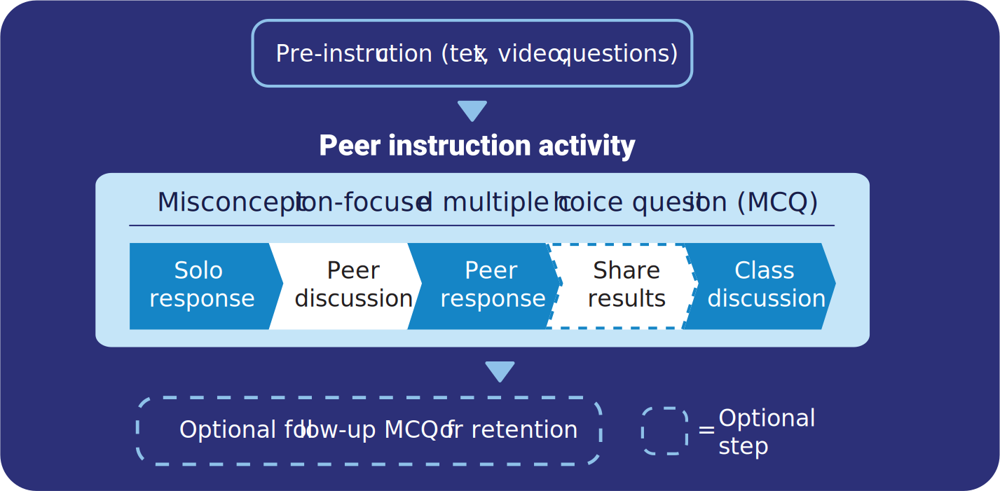
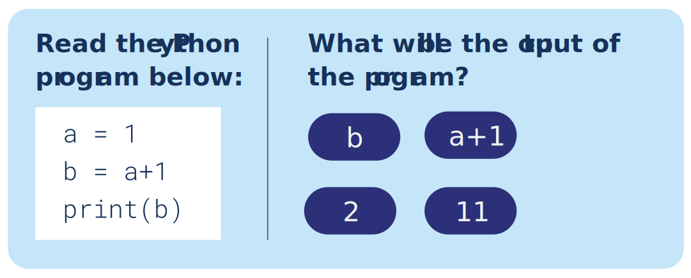

Peer instruction (PI) is an instructional technique first proposed in the 1990s by Eric Mazur,[^1] whose research demonstrated the benefits of focused discussion for pupils’ understanding and retention in physics. Subsequent studies have highlighted similar benefits of teaching using peer instruction in other subjects, including computing.[^2][^3]

>[!example]- Summary
>## Summary
>
>Peer instruction can replace a traditional presentation approach by combining pre-instruction, multiple choice questions, and peer discussion, to encourage deeper engagement with the content in question.
>
>### Benefits:
>
>* It is a straightforward approach for educators to apply in their classrooms
>* It leads to roughly double the learning gains when compared with no PI
>* Learners value the PI approach – especially the discussion element
>* Learners are more likely to retain key concepts and knowledge taught using PI
>
>## Key considerations:
>* Peer instructions should follow some pre-instruction stimulus, ideally before the lesson
>* Make sure that learners understand the rationale and benefits of PI
>* Always encourage participation over correctness; PI is a tool for learning, not assessment
>* Give learners challenging questions and time to discuss them
>* Decide if you want to collect response data, and if so, how

## What is peer instruction?

While the use of multiple choice questions (MCQs) is commonplace in classroom teaching, they are often only used for assessment. **Peer instruction** (PI) relies on carefully selected MCQs based on some pre-instruction material. In class, the MCQs are combined with peer discussion to explore and challenge student understanding.

Crucially, peer instruction begins with some form of pre-instruction (reading, videos, etc.), where learners can study and become familiar with the material in question before the discussion is held.

Peer instruction is carried out as follows:

1. The teacher poses a carefully selected MCQ. Learners have limited time to individually vote for their answer, using a
method such as voting cards, clickers, or raising their hand.
2. Learners then discuss the question and their answers in small groups, aiming for a consensus.
3. The teacher displays the same question, and now, learners vote according to their group consensus.
4. Optionally, the teacher shares the results of both votes to highlight where responses have changed.
5. Finally, the teacher leads a class discussion about the question, sharing the correct answer and exploring the distractor.

## The benefits of peer instruction

While most studies examining peer instruction have so far focused on its use in higher education, the practice offers
many benefits which should transfer to other settings:

- Mazur [^1] demonstrated that PI leads to significant learning gains for learners: those engaged with PI made up to twice as much progress as other learners. Similar effects have been found in subsequent studies,[^2] which also highlight the importance of the discussion element of PI.
- The same studies indicate that using PI in teaching helps students to retain knowledge.
- Once PI is part of the regular teaching practice, most students value the PI approach, recognise it’s benefits, value the discussion, and would recommend to PI to their other teachers [^2]
- PI is fairly straightforward to implement, and evidence shows that even teachers who are new to the practice can quickly see its positive effects [^2]
- Some researchers cite anecdotal evident that PI may encourage learners to develop a growth mindset.[^4]

## What makes a good multiple choice question?

Good-quality MCQs are deceptively hard to write, as teachers have to predict what misconceptions their learners are likely to hold. For some topic areas, there are lists of known misconceptions; for others, teachers need to rely on their experience.

While there are no definitive rules for developing MSQs, these are some guidelines:

- Questions should be clear and unambiguous
- Each question should test one concept only
- Learners should be able to answer questions quickly
- Teachers should learn something from each incorrect response
- It shouldn’t be possible to answer correctly while still holding onto a misconception

Below is an example of a question. Can you identify the correct response and explain what might lead learners to select the incorrect responses?

## Considerations for applying peer instruction

- For many teachers and learners, classroom peer instruction represents a change in practice. It is important to be clear about the purpose of this approach and how it can benefit learners

- Pi isn’t an assessment tool, but a means of instruction; educators should shift the focus away from getting the correct answers, and instead, promote the participation and discussion aspects of PI

- A Pi activity should be given as much as possible, especially the discussion step, which should last at least 2–4 minutes. This can feel like a long time

- If using an online voting system — such as handheld clickers or web-based quizzes — the recorded data can be helpful in predicting which learners may require extra interventions.

- Consider how challenging a PI question is; questions should be challenging enough to promote discussion. Mazur suggests that best results are seen where 50% of learners get the initial question wrong.

- Pre-instruction is important. With older learners, a flipped approach is best, requiring them to prepare by reading, watching a video, etc. Where home learning is not possible, peer instruction activities should build on previous lessons, or even on content studied earlier in the lesson.

## Where to start

- Review your content and highlight opportunities for pre-instruction. Consider what learning can be moved outside the classroom to enable discussion during the lesson

- Review and trial some [existing multiple choice questions](https://the-cc.io/q04_3)using peer instructions to diagnose some of your learners’ misconceptions.

- Write your own multiple choice question(s), describe the misconceptions that each answer addresses, and share the questions(s) with other educators.

- Encourage learners to deepen their understanding of a topic by writing their own MCQ.

- Visit [Peer Instructions for Computer Science](https://the-cc/qr04_4) for more guidance and resources.

[Online PDF](https://the-cc.io/qr04)

### References

[^1]: Crouch, C. & Mazur, E. (2001) Peer instruction: ten years of experience and results. *American Journal of Physics*. 69(9), 970–977.
[^2]: Porter, L., Bouvier, D., Cutts, Q., Grissom, S., Lee, C., McCartney, R., Zingaro, D. & Simon, B. (2016) A multi-institutional study of peer instruction in introductory computing. *Proceedings of the 47th ACM Technical Symposium on Computing Science Education.* New York, ACM. pp. 358–363.
[^3]: Simon, B. & Cutts, Q. I. (2012) Peer instruction: a teaching method to foster deep understanding. *Communications of the ACM*. 55(2), 27–29. 
[^4]:Simon, B., Hundhausen, C., McDowell, C., Werner, L., Hu, H. & Kussmaul, C. (2019) Students As Teachers and Communicators. In: Fincher, S. & Robins, A. (eds.) *The Cambridge Handbook of Computing Education Research.* Cambridge Handbooks in Psychology. Cambridge, Cambridge University Press, pp. 827–858.
[^5]:Barton, C. (2017) *What makes a good Diagnostic Question?* Available from: https://medium.com/eedi/what-makes-a-good-diagnostic-question-b760a65e0320. (Accessed 3 December 2019)