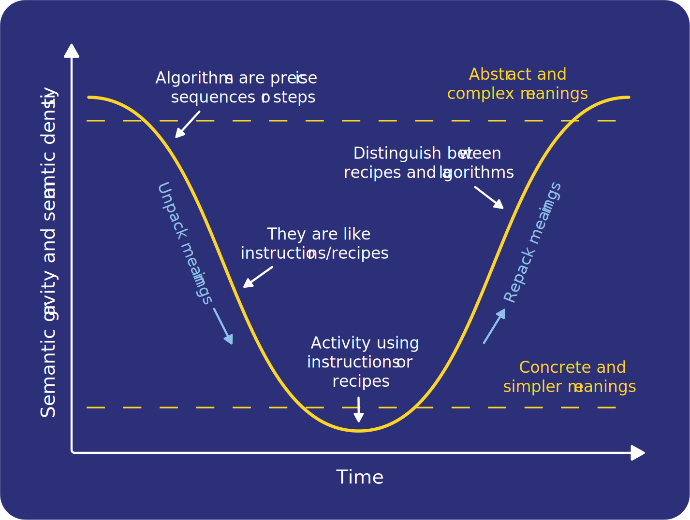

Semantic waves’ describe an ideal conceptual journey for novice learners to follow, shifting between expert and novice understanding, abstract and concrete context, and technical and simple meanings. It is part of [Legitimation Code Theory](https://thee-cc.io/qr06_3) or ‘LCT’ (Maton, 2013). Semantic waves have been successfully applied by educators across many disciplines, including computing, to plan and evaluate learning experiences. The theory also helps explain when and why metaphor and unplugged teaching works (and why sometimes, they might not).

>[!example]- Summary
>## Summary
>
>### Following a semantic wave structure:
>* Helps make expert knowledge accessible to novices
> * Varies the context of the concept to build links with concrete examples
>* Connects the technical terminology used in activities with simpler
meanings
>* Helps learners to unpack new concepts and repack them into more complex contexts, to encourage knowledge acquisition
>* Promotes securing knowledge of one concept before progressing to the next
> * Helps novices develop both understanding of abstract concepts
and mastery of technical meanings
>
>### Considerations:
>* Plan your lessons around a semantic wave structure; look for opportunities to unpack and repack concepts
>* Evaluate your lesson plans and explanations in detail, drawing the
semantic profile
>* Make sure that learning resources use both routes to expertise, varying either language or context
>* Avoid ‘semantic flatlines’, i.e never unpacking or repacking concepts
>* Complete each semantic wave and avoid the ‘down escalator’
>* Encourage learners to write their own explanations using semantic wave

## Following a semantic wave

Computing, and especially programming, is a subject with lots of technical terms that have precise technical meanings. To succeed, learners have to master the terminology whilst simultaneously developing a firm understanding of the concepts. A great strategy to support learners is to make your learning experiences follow a **semantic wave**.[^1] This involves introducing abstract concepts (with the associated terminology), but then using simpler language to explain their meaning. This is why metaphors, analogies, and unplugged computing are powerful ways to teach (provided that they are used well).[^2] However, it is important to then help students link those simpler meanings directly back to the abstract concepts and associated technical
language.

For example, when the educator introduces the idea of variables and assignment (using technical words and abstract concepts), learners are at the top of a semantic wave. To help learners descend the semantic wave, the educator might [explain variables using boxes](https://the-cc.io/qr06_4. To help them descend further, the educator might then illustrate the explanation with physical props. However, the educator shouldn’t leave learners thinking that it is just about boxes by only talking about moving values between boxes; they must help learners link it back to the technical and abstract, so that learners can surf back up the semantic wave. For example, the educator might demonstrate a sequence of assignments in Python step by step by putting values in boxes, or they might have learners follow a program fragment, to help learners repack the meanings. In traversing this wave, educators can support their learners to understand complex, abstract concepts that are underpinned by concrete and familiar ideas.

## Language and context

Experts and novices understand and describe concepts differently. Whilst novices are more comfortable using **concrete contexts** to express concepts in **simpler language**, experts are far more likely to describe the same concepts in the **abstract** and using **precise technical language**. Unpacking and repacking concepts is achieved by adjusting either of these two aspects. By decreasing the complexity and precision of the terminology (‘semantic density’),[^1] educators can make the ideas more accessible to learners. Educators may start with precise terminology such as ‘iteration’ or ‘selection’, but then use less precise terms for novices (e.g. ‘repeating’, or ‘decision’). An important final step is to return to the original and precise terms that were used to introduce the concept. 

The other approach to unpacking and repacking concepts revolves around the context through which they are presented (‘semantic gravity’).[^1] Educators do this all the time through analogy, unplugged activities, physical computing, etc. A more contextualised exploration of a concept gives learners a concrete example around which they can build their understanding. However, if learners don’t then step back from their concrete examples and view the concepts in the abstract, their understanding may become limited to the single context. 

For both language and context, the repacking phase in the semantic wave is crucial: during this phase, learners explore the nuance of technical terms like ‘algorithm’, as well as where analogies work, and where they break down. They move their understanding from the specific and concrete to the general and abstract.

## Semantic profiles

Semantic profiles are visual representations of changes in language and context within a learning activity, and allow educators to critique those experiences. Studies have identified some common teaching patterns that have poor semantic profiles, and therefore lead to poor explanations, and make it harder for students to learn.[^3]

High flatlining: The educator might only explain and discuss concepts in technical language and abstract contexts. This is what experts do when talking together; they do not unpack the meanings at all, as they can assume that the other has mastery of the language and concepts. Such an explanation is incomprehensible to a learner, as they do not understand the terminology.

Low flatlining: The educator might only use simpler examples and language, and never make the links to the concepts that they are trying to explain, or move out of specific contexts. For example, in a lesson about algorithms, if the educator just talks about recipes, learners may understand the explanation but never understand how recipes are like algorithms, or how they are not.

Down escalators: The educator might structure an explanation or lesson so that it takes learners down the semantic wave, but not back up. The educator makes a link from a technical concept, but learners do not repack the ideas during the activity. The class moves on to the next concept before having repacked the simpler meanings into the technical meanings.

## Reviewing learning activities

A really important use of semantic waves, and semantic profiles in particular, is as a basis for reviewing learning activities. By doing this, educators can predict and monitor the challenges for their learners, and improve their learning experiences. For example, in a recent paper, Waite et al.[^4] used this methodology to review the Barefoot activity **“Crazy Characters”.**

This Pedagogy Quick Read was adapted from Paul Curzon’s blog,[^5] which is based on the work of Karl Maton applied to a computing context. We would like to thank them both for their input.

[Online PDF](https://the-cc.io/qr06)

### References

1. [Maton, K. (2013) Making semantic waves: A key to cumulative knowledge-building. Linguistics and Education. 24(1), 8–22.](https://the-cc.io/qr06_5)
2. [Curzon, P., McOwan, P. W., Donohue, J., Wright, S. & Mars, D. W. (2018) Teaching of concepts. In: Sentance, S., Barendsen, E. & Schulte, C. (eds.) Computer Science Education: Perspectives on Teaching and Learning in School. London, Bloomsbury Publishing, pp. 91–108.](https://the-cc.io/qr06_6)
3. [Maton, K. (2019) Semantic waves: Context, complexity and academic discourse. In: Martin, J. R., Maton, K. & Doran, Y. J. (eds) Accessing Academic Discourse: Systemic Functional Linguistics and Legitimation Code Theory. London, Routledge, pp. 59–85.](https://the-cc.io/qr06_7)
4. [Waite, J., Maton, K., Curzon, P. & Tuttiett, L. (2019) Unplugged Computing and Semantic Waves: Analysing Crazy Characters. In: UKICER: Proceedings of the 1st UK & Ireland Computing Education Research Conference. New York, Association for Computing Machinery. Available from: doi.org/10.1145/3351287.3351291.](https://the-cc.io/qr06_8)
5. [Curzon, P. (2019) Tip 9: Follow Semantic Waves — Learning To Learn (To Program). Available  from: https://teachinglondoncomputing.org/learning-to-learn-to-program
[an informal blog about practical ideas for teaching programming]].(https://the-cc.io/qr06_9)