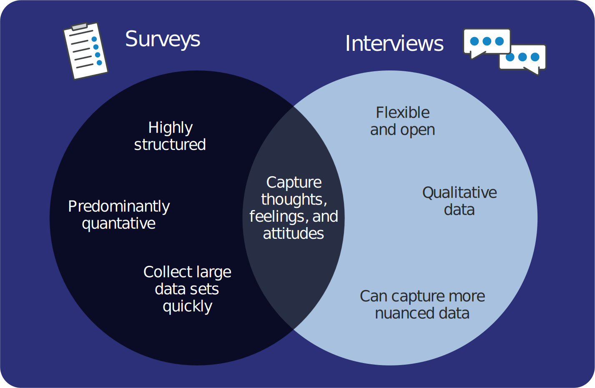

Surveys and interviews are common tools used by researchers to understand participants’ perceptions, attitudes, and feelings.

> [!example]- Summary
> ## Summary
> 
> **Surveys:**
>  * Highly structured in terms of questions, responses, and ordering
>  * Quick to produce and answer, meaning a large number of responses can be analysed
>  * Predominantly rely on closed-question types
>  * Data is typically quantitative
>  * Only capture what is asked and may lose nuanced responses
> 
> **Planning considerations:**
> * Clear, age-appropriate language
>  * Avoid ambiguity in questions
>  * Avoid questions that ask multiple things
>  * Avoid leading questions
>  * Only ask sensitive or emotive questions if it's integral to the research
> 
> **Interviews:**
>  * Less structured by nature
>  * Take time to produce, conduct, and analyse
>  * Questioning is generally more open
>  * Data is predominantly qualitative
>  * Captures nuance and richer responses
> 
> **Planning considerations:**
> * Use neutral responses and non-verbal cues
>  * Use prompts and reworded questions to elicit more detail
>  * Begin with simpler questions to make the learner feel comfortable
>  * Record and transcribe where possible to capture responses verbatim

Classroom action research is an effective approach that teachers can use to embed evidence-based pedagogies into their practice. This approach is the subject of the online course: [Improving Computing Classroom Practice Through Action Research](http://the-cc.io/qr09_3).

To understand your learners’ perceptions, attitudes, and feelings, you should use direct questioning so that they can describe their own experience or ‘self-report’. Self-report measures include face-to-face interviews and written or electronic surveys. Whilst each approach is different, they both require careful planning to ensure that they are effective, reliable, and valid.

## Interviews and surveys

The choice of whether to conduct an interview or survey will depend on the research question you aim to address. It will also affect the type and scope of the data you collect:

**Surveys** have a set order of questions and usually rely on a limited set of possible answers (either ‘Yes/No’, or a scale of agreement) with few (if any) open-ended questions. Surveys therefore tend to provide quantitative, or numerical, data.

**Interviews** can take a number of different forms. Some are fully structured like surveys, while others allow for more open-ended responses and/or more naturalistic conversation between the interviewer and the respondent. 

Interviews tend to provide qualitative data. The more structured types of interviews have the advantage of being reliable and replicable by other researchers, and often take less time to conduct than looser interview formats. However, you may lose the richer and more nuanced data collected in less-structured interviews.

One of the most common approaches to interviewing is the semi-structured interview, which has a guiding outline of topics to be covered, but no standardised questions or set order in which to ask them. This allows you as the interviewer to keep the questions closely related to your research aims, but also means that there is flexibility for conversation to develop naturally before looping back to a different topic.

## Language and context

The majority of surveys that you see will consist of closed questions. Although this can reduce the detail and richness of the information you gather, it does mean that you can collect a large amount of standardised and reliable data. However, there are a number of factors to be taken into account when writing, or judging the quality of, questions:

* Complex sentences, technical terms, or double negatives  should be avoided as respondents may not understand the question
* Questions should be written at an appropriate reading  age level for your respondents
* There should not be multiple interpretations of the question
* Only one question should be asked by any one survey item
* The question should not be constructed to lead to a particular response
* If there are any questions addressing emotive or sensitive issues, consider whether these items are research questions

As well as considering how you ask your questions, it is also important to think about your response options. When using scales, consider how many response options you present. Your respondents may find smiley faces or other pictorial options more accessible than a numbered or descriptive scale. Interspersing negatively worded questions can also reduce the effect of ‘response set’ when respondents get used to choosing a particular option. For example, within a scale on computing attitudes, you might include questions that produce the opposite responses.

1. “I really enjoy debugging code” 
2. “Debugging code isn’t an enjoyable part of programming” 

If the respondent were to choose ‘disagree’ for question 1, they should choose ‘agree’ for question 2.

## Good questioning in interviews

The principles for good questioning are also important when conducting interviews. However, other interpersonal factors also come into play in interview settings which can have a significant effect on the data.

You already have a relationship with your learners, which can be a benefit as it may mean that they are more open and honest in their responses. It can also have disadvantages if, for example, you have had less positive experiences with a particular learner.

In both cases, there will be a difference in power and authority between you and your interviewee, which may affect their responses. In particular, learners may respond in socially desirable ways, either purposefully to ensure you have a good opinion of them, or unconsciously.

Given this relationship, it is really important to show that you are neutral and non-judgemental in the interview. You can do this through your use of language and non-verbal cues. For example, responding to the interviewee by nodding and saying “I see” rather than sitting back in the chair with a puzzled expression could encourage your learners to be more open with their opinions.

Where learners give limited responses, you may need try the following to elicit more information:

 - Prepare some potential prompts that help you gather more information, after a question (e.g. “Could you tell me a little more about that?”)
 - Reword the question if it seems that the learner has not understood, although avoid reinterpreting what they have told you or leading them to a particular answer
 - Circling back to a topic later in the interview can also be beneficial as the interviewee may be more confident in expressing their opinions
 - Save more complex or sensitive questions for later in the interview to make sure your learners are comfortable

## Conclusion

The decision concerning whether to use a survey or a questionnaire depends on the research question you aim to address. But it also depends on the time you have available to develop your questions and collect your data. There are many [validated surveys](http://the-cc.io/qr09_4) readily available to use in your research, and this method allows you to gather a lot of data quite quickly. A survey would be particularly useful if you wanted to collect data from all the learners in your class. If you develop your own semi-structured **interview**[^1], you will need to focus on a smaller number of respondents because of the time required to conduct the interview and then to code and analyse the qualitative data gathered. In both cases, the validity of the questions is vital, as is the way in which they are delivered.

[Online PDF](https://the-cc.io/qr09)

### References

[^1]: Turner III, D.W. (2010) Qualitative interview design: a practical guide for novice investigators. The Qualitative Report, 15 (3), 754–760. 
McLeod, S. A. (2014) The interview research method. Available from: https://www.simplypsychology.org/interviews.html 
McLeod, S. A. (2018) Questionnaire: definition, examples, design and types. Available from: https://www.simplypsychology.org/questionnaires.html

