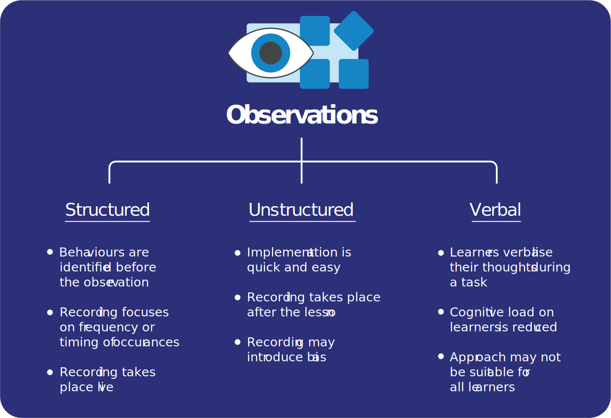

Classroom action research is an effective approach that teachers can use to embed evidence-based pedagogies into their practice. This approach is the subject of the new online course: [Improving Computing Classroom Practice Through Action Research](http://the-cc.io/qr10_3).

To understand behaviour and how it changes as a result of your action research, you can use different types of observation techniques. The technique chosen will depend on your research question and the type of action you are taking in your research.

> [!example]- Summary
> ## Summary
> 
> ##Key Benefits:
> 
> Observation approaches enable teacher-researchers to record data about the behaviours exhibited by their students
> 
> **Structured observations:**
>  * Involve coding and collecting data from live observation or recordings
>  * Involve recording the frequency of particular **events**, or the occurrence of  behaviours within particular **time intervals**, to capture the prevalence or timing of specific behaviours
>  * Require identification of target behaviours **before** you conduct observations
>  * Enable quick collection of lots of data, but may exclude the nuances
>  * Do not require learners to verbalise their thoughts
> 
> **Unstructured observations:**
> * Involve reflecting on and recording observations after the lesson
> * Are quicker and easier to plan than strucutured observations
> * Have the potential to introduce bias into the data
> 
> **Verbal protocols:**
>  * Involve asking learners to verbalise  their thinking during a task, and recording these verbalisations
> * Provide an insight into learners’ thinking through their behaviour (response)
> * Cause a smaller cognitive load for learners than participating in interviews does
> * May not be suitable for all learners or situations
> 
> Each approach has advantages and disadvantages, and may be best applied in combination with other methods, including interviews and surveys.

## Structured observation schedules

You can collect quantitative data on behaviour by using structured observation schedules, in which you code behaviour either as it happens in a live setting, or from recordings made during lessons. You can do this by coding particular **events** of interest, such as when learners ask for help, or by coding the different types of behaviour that are exhibited in a particular **time interval**, such as the first five to ten minutes of a lesson. Examples of how you could set up an observation schedule for event or interval coding are presented in the figure.

| Group | Ask teacher | Refer back to board | Explain concept to each other |
|:-----:|-------------|----------------------|--------------------------------|
|   1   | IIII        | I                    | II                             |
|   2   | II          |                      | IIII                           |
|   3   | III         | I

| Time interval  | Group | Ask teacher | Refer back to board | Explain concept to each other |
|----------------|:-------:|-------------|----------------------|--------------------------------|
| First 5 mins   | 1     | ✓           | ✓                    |                                |
| Second 5 mins  | 1     |             | ✓                    |                                |
| Last 5 mins    | 1     |             |                      | ✓                              |

Observation schedules for events (top) and intervals (bottom). For event coding, you may keep a tally of each time a particular behaviour is seen. For interval coding, you may record whether a particular behaviour occurs at different times in the lesson.

An advantage of using structured observations is that you can record behaviour that is occurring naturally in your classroom, and it does not rely on learners being able to verbalise their thoughts or feelings. Identifying behaviour to look for in advance of the lesson also reduces any bias that you may have developed based on your previous interactions with learners (the so-called ‘Halo Effect’)[^1][^2], which could affect your interpretation of learners’ actions as an observer. 

While structured observations are likely to be more consistent and reliable than other types of observation, the strict coding of behaviour in this way may exclude elements of the social context and individual variability of the behaviour. For example, simply coding the number of questions asked will not capture the more detailed, and potentially enlightening, data surrounding the types of questions asked: one group may ask questions for clarification, while another group may ask questions to extend their learning, and learners may ask different types of questions at different stages of an activity. 

It is also difficult to conduct this type of observation while continuing to participate in the lesson as the teacher. You may require additional members of staff or need lessons to be recorded, which could raise ethical issues and make the process longer.

## Unstructured observations

You may feel that the structured approach outlined above will not allow you to directly address your research question, but you may still be interested in the behaviour of your learners. As an active participant within your research setting (the classroom), you may wish to record observations retrospectively during breaks or after lessons, and then bring these together later to provide a snapshot of classroom interactions. Using the example of questioning, you could record the changing tone of questions over the course of the lesson, or note down any particular questions that gave you an insight into how your learners were approaching the task.

It is important to think about your own role in these interactions. For example, you may have changed the way that you explained something in response to a question, which may have led to learners asking fewer questions. You should also consider the potential biases that you may have when recording your observations, such as whether you may be more likely to remember questions from learners who you know find particular concepts difficult. The fact that your active role in the classroom may affect results does not mean that you should not take this approach, but you should be aware of these issues and discuss them explicitly when sharing your results with others.

## Verbal protocols

An indirect form of observation is through the use of verbal protocols. This involves asking learners to ‘think aloud’, i.e. to verbalise what they are thinking, while they carry out a task, and recording these verbalisations (either writing them down or using audio recordings to be transcribed later). This allows you to link their behaviour (in this case, their verbalisations) to their thought processes. This is a different process from interviewing learners about how they solved problems or what they thought about a task, as it requires a much lower [cognitive load](http://the-cc.io/qr10_4) and awareness of their own thought processes. This might be a particularly useful approach when trying to understand learners’ problem-solving strategies in computing lessons. However, it is important to think about the context of these observations and the impact that this approach might have on some learners, for example, if they are not confident speaking in front of others, or if they have speech and language difficulties and find verbalisation difficult.

## Conclusion

It is important to weigh up the advantages and disadvantages of the different methods, and to choose the observation technique that is best suited to your research question. Note that observations are useful for understanding and recording behaviour, but that you may need to combine them with interviews or surveys if you also want to understand individual learners’ thoughts and feelings about their experiences. If you plan to use a structured observation schedule, take some time to think carefully about the types of behaviour that you are targeting and how it is best to record them given your role within the classroom. Finally, make sure that you are aware of any ethical issues relating to observing your learners without their knowledge or sharing data from these observations with others.

[Online PDF](https://the-cc.io/qr10)

### References

[^1]: Neugaard, B. (2016). *Halo effect | psychology*. In: Encyclopædia Britannica. [online] Available at: https://www.britannica.com/science/halo-effect. 

[^2]: Coolican, H. (2017) *Research Methods and Statistics in Psychology*. Sixth edition. Hove, Psychology Press.

