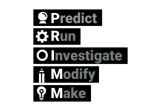
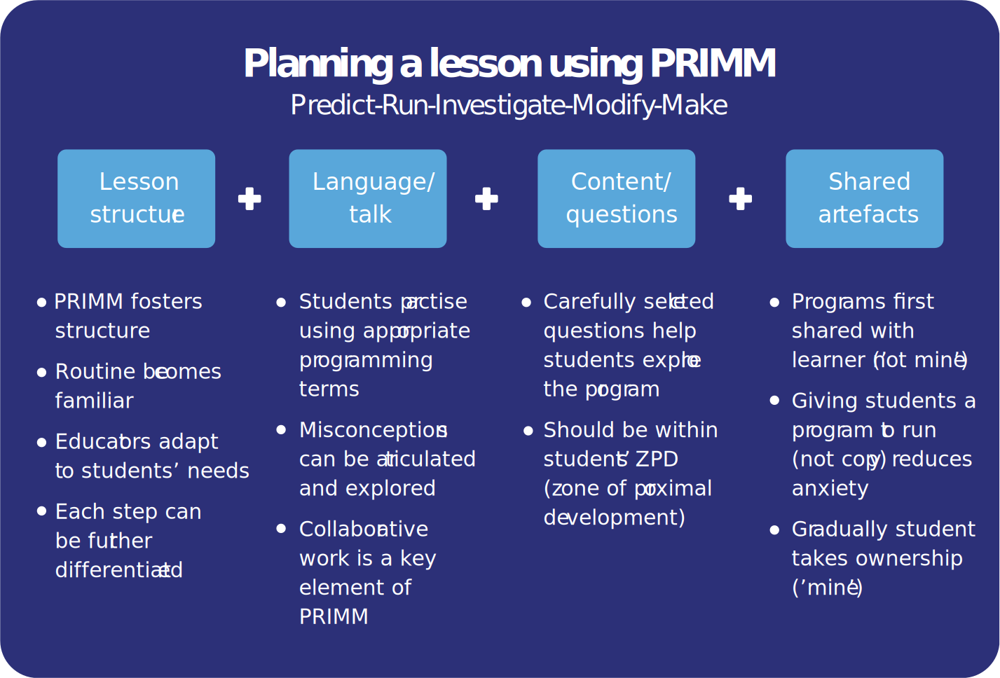
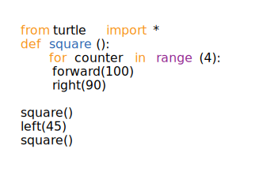

PRIMM is an approach that can help teachers structure lessons in programming. PRIMM stands for Predict, Run, Investigate, Modify and Make, representing different stages of a lesson, or series of lessons. PRIMM promotes discussion between learners about how programs work, and the use of starter programs to encourage the reading of code before writing.

> [!example]- Summary
> PRIMM is a way of structuring programming
> lessons that focuses on  
> 
> * Reading code before you write code
> * Working collaboratively to talk about programs
> * Reducing cognitive load by unpacking and understanding what program code is doing
> * Gradually taking ownership of programs when ready
> 
> ### The five stages:
> 
> **Predict**
> * Focus on the function of the code
> * Encourage discussion
> * Work in pairs or threes
> 
> **Run**
> * Provide students with working code to run
> * Check against prediction
>  
> **Investigate**
> * Use a variety of activities, for example, tracing, annotating, questioning, etc
> * Encourage students to discuss and work in pairs or small groups with the code
>  
> **Modify**
> * Modify code in small steps to add new functionality
> * Apply what has been learnt about the structure of the code
> * Gradual increase in difficulty
>  
> **Make**
> * Create a new program
> * Practise the programming skills that have been learnt
> * Can be a design or an open task
> 
> ### Does it work?
> * A study in 2018 with 500 learners aged  11–14 showed improved learning outcomes  after 8–12 weeks of programming lessons using PRIMM[^1]
> * PRIMM has been put into practice by many teachers in primary and secondary schools around the world

## The five stages of PRIMM

**Predict:** Students discuss a program and predict what it might do; they can draw or write out what they think will be the output. At this level, the focus is on the function of the code.

**Run:** Students run the program so that they can test their prediction and discuss in class.

**Investigate:** The teacher provides a range of activities to explore the structure of the code, such as tracing, explaining, annotating, debugging, etc.

**Modify:** Students edit the program to change its functionality via a sequence of increasingly more challenging exercises; the transfer of ownership moves from the code being ‘not mine’ to ‘partly mine’ as students gain confidence by extending the function of the code.

**Make:** Students design a new program that uses the same structures, but solves a new problem (ie has a new function).

You may not be able to go through all stages in one lesson and may even focus on one stage more than another. Remembering PRIMM gives you a way of labelling what you are doing when you are teaching programming.

The PRIMM approach builds and draws on other research in computing education, including Use-Modify-Create[^2], tracing and reading code before writing[^3], the Abstraction Transition Taxonomy,[^4] and the Block Model[^5]. The focus on language
and talk, and the use of starter programs, draws on a sociocultural perspective to the way that children learn programming.

## Encouraging talk in the classroom

Classroom discussion is an important aspect of the teaching of many subjects, but isn’t often referred to with respect to the teaching of programming. Many PRIMM
activities are carried out in pairs, and we already know that pair programming is an effective form of learning, and involves learners practising to articulate what to do
when writing a program. PRIMM goes a step further and encourages Predict and Investigate activities to be carried out in pairs/small groups, away from the computer.

This has the following benefits:

 * Talking about a program and how to works helps  learners to find the right terminology to use to  articulate their understanding. Having a common language to talk about programming constructs is important.
 
 * Actually verbalising out loud the steps of a program that are difficult to understand can help learners to focus on atomic, or smaller elements at a time.
 
 * Through dialogue with others, we can ask and answer questions, and learn from others

## Read before you write

The first activity in a PRIMM-like lesson involves predicting what a small segment of code will do when it runs. It doesn’t require stating how it will do that, just the outcome. This shouldn’t be an assessed exercise, so that all children are encouraged to have a go, and it’s important that it is low stakes. Sometimes the output can be drawn, sometimes the teacher will provide some sample inputs, all depending on what kind of code it is. 

This aspect of PRIMM builds on decades of research that has shown that reading code before writing it is an effective way to learn programming. For example, work by Lister and colleagues over many years highlighted the importance of reading code and being able to trace what it does before  writing new code. Comparing tracing skills to code writing, they demonstrated that novices require a 50% tracing code accuracy before they can independently write code with confidence[^6].

## Not starting from scratch

It can be very stressful for novice programmers to write code into a blank editor window. The syntax needs to be right, or quite intimidating error messages can appear. It’s easy to be put off having a go, or for teachers to resort to getting students to copy code that they don't yet understand. 

By running a program that the teacher has written, the learner doesn’t have ownership of that ‘starter’ program and does not have the emotional angst when it doesn’t work. That’s why in PRIMM, the Run stage involves running a program provided on a shared drive to check the prediction. Gradually, once the student has some understanding of how the code works, they can modify the code and take ownership of the new functionality. 

## Drawing on sociocultural theory

Social constructivism, in particular the work of the psychologist Vygotsky, can frame our understanding of novice programmers and their learning. This interpretation
of the learning process can help us to develop effective pedagogical strategies.

Vygotsky proposed that mediated activity promotes higher mental processes, and identified three major forms of mediation: material tools, psychological tools (including language), and interaction with other human beings. Mediation allows learners to act as apprentices before internalising new ideas, and sociocultural theory (SCT) suggests that movement from the ‘social plane’ to the ‘cognitive plane’ supports the learning of skills and knowledge. With the PRIMM approach, the ‘starter
programs’ that are shared and discussed can be seen as being on the social plane, with a mediated progression to the cognitive plane once understood and internalised¹.

[Online PDF](https://the-cc.io/qr11)

### References

[^1]: Sentance, S., Waite, J., & Kallia, M. (2019) Teaching computer programming with PRIMM: a sociocultural perspective. *Computer Science Education*. 29 (2–3), 136–176. DOI: 10.1080/08993408.2019.1608781.85.

[^2]: Lee, I., Martin, F., Denner, J., Coulter, B., Allan, W., Erickson, J., Malyn-Smith, J. & Werner, L. (2011) Computational thinking for youth in practice. *ACM Inroads*. 2(1), 32–37.

[^3]: Lister, R., Adams, E. S., Fitzgerald, S., Fone, W., Hamer, J., Lindholm, M., McCartney, R., Moström, J. E., Sanders, K., Seppälä, O., Simon, B. & Thomas, L. (2004) A multi-national study of reading and tracing skills in novice programmers. *ACM SIGCSE Bulletin*. 36(4), 119–150.

[^4]: Cutts, Q., Esper, S., Fecho, M., Foster, S. R. & Simon, B. (2012) The Abstraction Transition Taxonomy: Developing desired learning outcomes through the lens of situated cognition. In: *Proceedings of the Ninth Annual International Conference on International Computing Education Research*. New York, ACM. pp. 63–70.

[^5]: Schulte, C. (2008) Block Model: An Educational Model of Program Comprehension as a Tool for a Scholarly Approach to Teaching. In: *Proceedings of the Fourth International Workshop on Computing Education Research*. New York, ACM. pp. 149–160.

[^6]: Venables, A., Tan, G. & Lister, R. (2009) A closer look at tracing, explaining and code writing skills in the novice programmer. In: *Proceedings of the Fifth International Workshop on Computing Education Research*. New York, ACM. pp. 117–128.

[^7]: Walqui, A. (2006) Scaffolding instruction for English language learners: A conceptual framework. *International Journal of Bilingual Education and Bilingualism*. 9(2), 159–18
