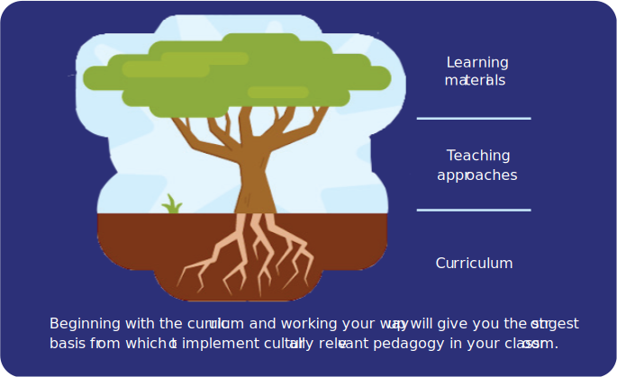

For computing to be relevant, engaging, and accessible to all, educators should reflect on their curriculum, materials, and teaching practices. Educators can draw on the breadth of students’ experiences and cultural knowledge, facilitate projects that have personal meaning for learners, and discuss issues of bias and social justice.

> [!example]- Summary
> **Culturally relevant pedagogy emphasises valuing all learners’:**
> 
> * Knowledge
> * Heritage
> * Ways of learning
> 
> **Culturally responsive teaching includes:**
> 
> * Opportunities for personally meaningful projects
> * Curricula that draw on learners’ cultural knowledge and experience
> * Exploration of ethics, social justice, and bias
> 
> **Benefits of culturally responsive teaching are that it:**
> 
> * Improves learners’ attitudes towards the subject
> * Encourages more learners to continue with computer science
> * Improves understanding of core concepts
> 

## What is culturally relevant pedagogy?

**Culturally relevant pedagogy**[^1] is a teaching framework that emphasises the importance of incorporating and valuing all learners’ knowledge, ways of learning, and heritage. It lets learners address issues that are important to them and discuss ethics, power, privilege, and social justice.

**Culturally responsive teaching**[^2] builds on this framework to identify teaching practices for the classroom. These include:
- Drawing on learners’ cultural knowledge and experiences to inform the curriculum
- Allowing learners to choose personally meaningful projects and to express their own cultural identities
- Exploring issues of social justice and bias

It’s important when using the term ‘culture’ not to focus on only one characteristic, a person’s cultural identity is based on a range of influences, including their age, gender, where they live, their family income, and their religious beliefs. Making computing responsive to different elements of learners’ cultural identities — including youth culture, a key influence on learners’ interests and attitudes — will engage a wider range of learners.

In computing, taking this approach has been demonstrated to:
- Improve learners’ attitudes towards the subject, including engagement, confidence, and feelings of belonging[^3][^4]
- Encourage more learners to select computer science as a qualification[^3]
- Lead to learning gains in computational thinking and core computing concepts[^5][^6]

Providing authentic and meaningful contexts for learning computing and identifying different applications of computer science outside of school can help more learners see the relevance of computing to their lives and their communities.

### How do you implement culturally relevant pedagogy in the computing classroom?

The Raspberry Pi Foundation’s ‘**Culturally relevant and responsive computing in the classroom: A guide for curriculum design and teaching’** identifies three main focus areas: curriculum, teaching approaches, and learning materials. The guidelines provide practical suggestions and links to resources that will help you develop your culturally relevant approach. Some key elements are outlined below:

To keep learners engaged, **contextualise** computing and **make connections** with other aspects of learners’ lives by including the social, historical, or political context of a particular development in technology or making cross-curricular links to other subjects, or to specific times in the school calendar (e.g. Black History Month, Internet Safety Day).

**Allow student choice** in projects as this can encourage them to persist when facing difficulties. Provide tasks that are **open-ended, inquiry-led, and require problem-solving.** Promote collaboration and discussion, which allows learners to share expertise and knowledge and challenges stereotypes about computing as a career.

Ensuring your learning materials are accessible and providing **inclusive representations** of people, places, and cultures is important for engaging and inspiring learners. E.g. using and translating video captions can support those with English as an additional language or avoiding computing stereotypes by showing diverse groups of people.

### Considerations for designing and implementing a culturally relevant computing curriculum
 
 For culturally relevant pedagogy to work, teachers must understand and embrace its principles. Adding a few ‘add-on’ activities to regular teaching will not have the same impact as incorporating the approach throughout your lessons. To do this, you may need to reflect on your own cultural identity and how this affects the way you experience the world, and computing as a subject.
 
 Auditing your current teaching
 - It is vital that teachers understand their current teaching and identify areas where changes could be made.
 - It is useful to work on this activity with a team of teachers, where possible. This will bring together different ideas and cultural identities between teachers, and ensure consistency across different classes.
 - It is even better if teachers can work across disciplines to incorporate culturally relevant pedagogy in a cross-curricular way to embed the approach within the school
 
 Preparing for uncomfortable conversations
 - You may have to have some uncomfortable conversations with both colleagues and learners as part of the process of uncovering unconscious biases and discussing meaningful, complex topics. It is important to model how to deal with these conversations sensitively.
 - It is vital that learners and teachers are able to speak openly and feel that their opinions and experiences are being heard and valued. This will take time, and opportunities should be built in throughout the curriculum to develop trust in the process.
 
 The Raspberry Pi Foundation’s guidelines can help you improve your understanding of the approach and its core principles, and links to some suggested professional development resources.

[Online PDF](https://the-cc.io/qr18)

### References

[^1:] Ladson-Billings, G. (1995). Toward a theory of culturally relevant pedagogy. *American educational Research Journal*, 32(3), 465–491.
[^2]: Gay, G. (2000). *Culturally responsive teaching: Theory, research, and practice.* New York: Teachers College Press.
[^3]: DiSalvo, B., Guzdial, M., Bruckman, A., & McKlin, T. (2014). Saving face while geeking out: Video game testing as a justification for learning computer science. Journal of the Learning Sciences, 23(3), 272–315.
[^4]: Ashcraft, C., Eger, E.K., & Scott, K.A. (2017). Becoming technosocial change agents: Intersectionality and culturally responsive pedagogies as vital resources for increasing girls’ participation in computing. *Anthropology & Education Quarterly*, 48(3), 233–251. DOI: 10.1111/aeq.12197
[^5]: Davis, J., Lachney, M., Zatz, Z., Babbitt, W., & Eglash, R. (2019, February). A cultural computing curriculum. In *Proceedings of the 50th ACM Technical Symposium on Computer Science Education*, online (pp.1171–1175). Association for Computing Machinery.
[^6]: McGee, S., McGee-Tekula, R., Duck, J., McGee, C., Dettori, L., Greenberg, R. I., Snow, E., Rutstein, et al. (2018). Equal outcomes 4 all: A study of student learning in ECS. In P*roceedings of the 49th ACM Technical Symposium on Computer Science Education,* online (pp.50–55). Association for Computing Machinery.
[^7]: Means, B.M. & Stephens, A. eds. (2021). *Cultivating interest and competencies in computing: Authentic experiences and design factors.* Washington, DC: The National Academies Press. DOI: 10.17226/25912